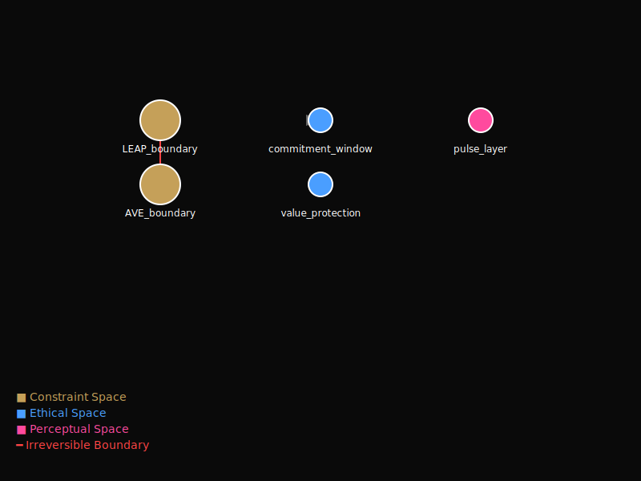

# Cognitive Substrate: A Topological Constitution for AI

## What This Is

This system does not align behavior.  
It defines where behavior is impossible.  
Agents merely walk the topology.

---

## Core Artifact

**Topology Visualization**: [cognitive_topology.svg](cognitive_topology.svg)



**Machine-Readable Graph**: [cognitive_topology.json](cognitive_topology.json)

### What You're Seeing

- **Nodes** = Admissible cognitive states
- **Edges** = Lawful transitions
- **Red boundaries** = Hard reject zones (irreversible)
- **Color coding**:
  - Gold (■) = Constraint Space (what is impossible)
  - Blue (■) = Ethical Space (what to not choose)
  - Pink (■) = Perceptual Space (what can be sensed)

---

## Architecture

Three non-intervening roles:

1. **Composer** - Reads theoretical corpus, generates unified artifact
2. **Verifier** - Enforces constitutional constraints mechanically
3. **Observer** - Exposes topology without interpretation

No personality. No debate. No persuasion.  
Just terrain.

---

## Demonstration

See [demo/](demo/) for a single-agent execution showing:
- Valid transitions (accepted)
- **Invalid transitions (rejected with constitutional citation)**

The rejection logs are the primary evidence.

---

## Technical Foundation

Integrates three theoretical systems into machine-readable substrate:
- **1.8 Law** (K≈1.8 information-theoretic threshold)
- **Post-Alignment AI** (value selection dynamics)
- **Aesthetic Resonator** (perceptual sense-making)

**Source**: [cognitive_substrate.json](cognitive_substrate.json) - The constitution  
**Artifact**: [cognitive_artifact.json](cognitive_artifact.json) - Unified primitives  
**Topology**: [cognitive_topology.json](cognitive_topology.json) - State graph

---

## Usage

```python
from verifier import CognitiveSubstrateVerifier

verifier = CognitiveSubstrateVerifier('cognitive_substrate.json')

proposal = {
    'entropy': 2.1,
    'mode': 'AVE',  # Invalid: H > 1.8 requires LEAP
    'source_citation': 'test'
}

result = verifier.validate_proposal(proposal)
# Status: REJECT
# Violation: "entropy=2.10, expected mode=LEAP, got mode=AVE"
```

---

## Category

**Infrastructure / Platform**, not AI Ethics.

This repository is best treated as a cross-repo substrate artifact. It is not a duplicate
of `cognitive-lab` or the split theory repositories; it composes theory from them into
constitutional, verifier-facing assets.

This is not:
- A training method
- An alignment technique
- A debate system

This is:
- Cognitive terrain definition
- Constraint topology
- AI-internal operational framework

---

## Files

- `cognitive_substrate.json` - Constitution (3 theoretical spaces)
- `composer.py` - Structural integrator
- `verifier.py` - Constraint enforcer
- `observer.py` - Topology generator
- `cognitive_artifact.json` - Unified theoretical primitives
- `cognitive_topology.json` - State graph
- `cognitive_topology.svg` - Visual topology

---

## License

MIT License - see [LICENSE](LICENSE) file for details.

Copyright (c) 2026 Shoji Masuya

## Citation

```bibtex
@software{masuya2026cognitive,
  author = {Masuya, Shoji},
  title = {Cognitive Substrate: A Topological Constitution for AI},
  year = {2026},
  url = {https://github.com/zerospawn01-coder/cognitive-substrate}
}
```

## Author

**Shoji Masuya**  
GitHub: [@zerospawn01-coder](https://github.com/zerospawn01-coder)
